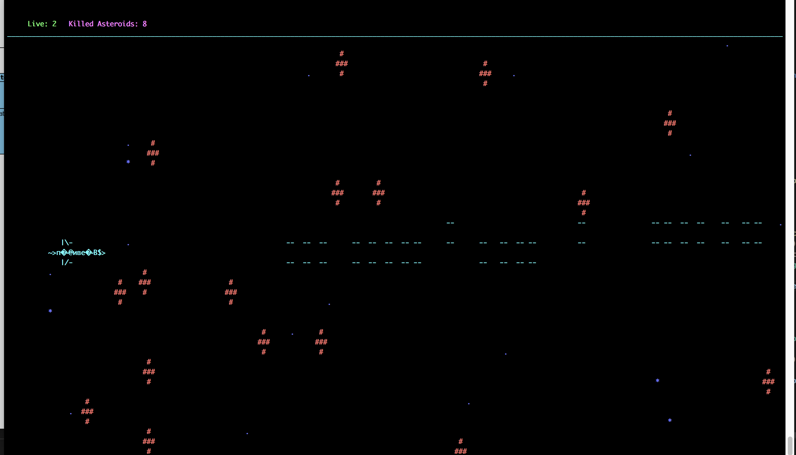

NcurserWars
This project from Unit Factory (42 school).
Its was end of first week cpp piscine (intensive study of c++ language). Our task was write console game like space invaders or similar in a 2 days.

Work on a Unix system. The system must have an ncurses library;

To make it possible to play just do the following steps:
In root directory type: 
1) make  
2) ./NcurserWars  
3) Enjoy the game!
 
Arrows to move 
Space to shooting 

